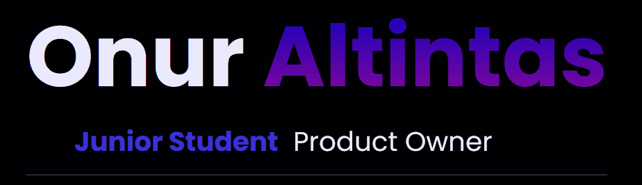

# Hello ✋
- ### [About me](#about-me)
  - #### [Who am I](#who-am-i)
  - #### [My skills](#my-skills)
  - #### [My socials](#my-socials)
- ### [Projects](#projects)
  
 
 
 
 
 

# About me
### Who am I
Hey there, my name is Onur. Welcome to my GitHub portfolio! I'm a 19 years old software developer student who's all about creating cool stuff with code. I'm super curious and always up for learning something new. I'm a big fan of Java and backend work, but I also like dabbling in frontend projects just for fun. I like to read about project management methodes like Scrum etc.

#### Here's a peek at what drives me as a software developer:;  
Critical thinking skills  
Communication  
Collaboration skills  
Attention to detail  
Motivation  
Learning  
Collaboration skills  
Time management  

 

| Skill              | Level |
| :---------------- | :------: |
|  |      |
|  |     |
|     |     |
| |     |
|  |  |
|  |    |
|  |    |
|  |    |
| |    |
|  |  |
|  |    |
|   |    |
| |    |
|   |    |
|  |  |
| |    |
| |    |
|  |  |
| |    |

### My Socials
 

# Projects

